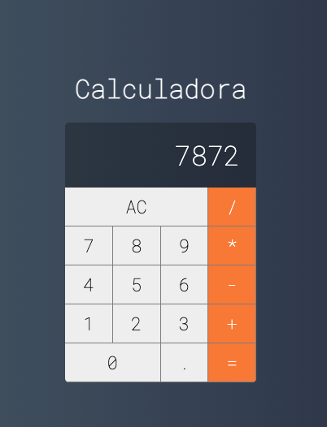

# Calculator    



The present project has the goal of creating a calculator with Vue 2.

## Project setup

### To run with Docker

```
docker build -t <any-name> .
```

Change the name "any-name" to another of your choice.

```
docker run -p 8080:8080 <any-name>
```

To start the project.

### Local
```
npm install
```

### Compiles and hot-reloads for development
```
npm run serve
```

### Compiles and minifies for production
```
npm run build
```

### Lints and fixes files
```
npm run lint
```

### Customize configuration
See [Configuration Reference](https://cli.vuejs.org/config/).
